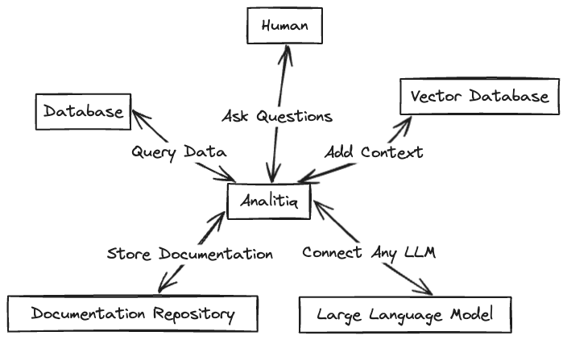

# Analitiq
Analitiq is a Framework for managin your data using LLMs. Analitiq can be extended with your own services written in python. These custom services can address your unique tasks for managing your data and they can function as part of the overall analytical engine of Analitiq.


Analitiq currently supports the following LLM models
- ChatGPT
- Mistral
- Bedrock (AWS)

Analitiq currently integrates with the following vectorDBs
- Weaviate
- ChromaDB

## What Analitiq needs to work
Since Analitiq is a framework to help data people manage data using LLMs, it requires at the least:
1. Access to LLM
2. Access to Database

As an extra bonus and to make things even smarter, it could also use:
3. Access to Vector Database with documentation.

## Quick Start
1. Clone the repo
2. Set up `profiles.yml` in root directory. The file `profiles.yml` has all of your sensitive info, such as your API keys and DB credentials, so treat it with respect. Under `uses` you can define which connections should be used for the current deployment. 
Ideally, you would have different `profiles.yml` for your prod and dev instances.
```yaml
test:
  connections:
    databases:
      - name: prod_dw
        type: postgres
        host: xxxxx
        user: xxxx
        password: 'xxxxx'
        port: 5432
        dbname: sample_db
        dbschema: sample_schema
        threads: 4
        keepalives_idle: 240 # default 240 seconds
        connect_timeout: 10 # default 10 seconds
        # search_path: public # optional, not recommended
    llms:
      - name: prod_llm
        type: openai
        api_key: xxxxxx
        temperature: 0.0
        llm_model_name: gpt-3.5-turbo
      - name: dev_llm
        type: mistral
        api_key: xxxxxx
      - name: aws_llm
        type: bedrock
        credentials_profile_name: my_profile
        provider: anthropic
        llm_model_name: anthropic.claude-v2:1
        temperature: 0.0
    vector_dbs:
      - name: prod_vdb
        type: weaviate
        host: example.com
        api_key: xxxxx

  usage:
    databases: prod_dw
    llms: aws_llm
    vector_dbs: prod_vdb
```
3. Set up `project.yml` in root directory. The file `project.yml` has all of your project data, such as where the logs are stored. Most importantly, `project.yml` defines where your custom Services are located so Analitiq can pick them up and use them to manage your data.
```yaml
name: 'analitiq'
version: '0.1'
profile: 'test'
config_version: 2

config:
  general:
    chat_log_dir: "chats" # this is where we save our chat logs.
    sql_dir: "analysis" # this is where the ETL SQLs are being saved and managed
    services_dir: "custom_services"
    session_uuid_file: 'session_uuid.txt' # Where session identifier is being recorded. When session is reset, it is like beginning of a new chat topic and new log file will be created.
    target_path: "target"
    message_lookback: 5 # when LLM has no clue about users request, or users request relates to some item in chat history, how far back (in number of messages) should the LLM look in the current session chat log
  vectordb:
    doc_chunk_size: 2000
    doc_chunk_overlap: 200

services:
  - name: ChartService
    description: "Use this service to generate script for APEX charts to visualize data"
    path: "custom_services/chart/chart.py"
    class: "Chart"
    method: "run"
    inputs: "dataframe as serialized json"
    outputs: "javascript that is used by the frontend to visualize data"
```
5. Run the example file `example.py` (located in the root directory.)

## Configuration files

There are 2 configuration files:
1. profiles.yaml - this file has all the secrets and connections needed to connect to LLMs, VectorDBs, Databases. Because you may have different production and development environments, profiles.yaml allows you to define multiple profiles (and multiple credentials).
2. project.yaml - this file has the parameters needed for your particular project, including what profile to use. You can define the profile in `profile` parameter. 
Once you have your project deployed, you can specify which profile to be used by that particular project in `project.yaml`. 

Let's look at some examples. Let's say when I run Analitiq locally, I want to use OpenAI. And when I upload it to production server, I want to use Bedrock.

I will set up my connections in profile.py
```yaml
prod:
  connections:
    databases:
      - name: prod_db
        type: postgres
        host: xxxx
        user: xxxx
        password: xxxx
        port: 5432
        dbname: postgres
        dbschema: sample_data
        threads: 4
        keepalives_idle: 240 # default 240 seconds
        connect_timeout: 10 # default 10 seconds
        # search_path: public # optional, not recommended
    
    llms:
      - name: aws_llm
        type: bedrock
        credentials_profile_name: bedrock
        region_name: eu-central-1
        provider: anthropic
        llm_model_name: anthropic.claude-v2
        temperature: 0.0
        aws_access_key_id: xxxxx
        aws_secret_access_key: xxxxx
  usage:
    databases: prod_db
    llms: aws_llm

local:
  connections:
    databases:
      - name: local_db
        type: postgres
        host: xxxx
        user: xxxx
        password: xxxx
        port: 5432
        dbname: postgres
        dbschema: sample_data
        threads: 4
        keepalives_idle: 240 # default 240 seconds
        connect_timeout: 10 # default 10 seconds
        # search_path: public # optional, not recommended

    llms:
      - name: openai_llm
        type: openai
        api_key: xxxx
        temperature: 0.0
        llm_model_name: gpt-3.5-turbo
  usage:
    databases: local_db
    llms: openai_llm
```

on my local machine, I would have `project.py` file with the following configuration
```yaml
name: 'analitiq'
version: '0.1'
profile: 'local'
config_version: 2
```
and the production server will have `project.py` file with the following configuration
```yaml
name: 'analitiq'
version: '0.1'
profile: 'prod'
config_version: 2
```

Now, I can move the project files between my prod environment and local and Analitiq will use different configuration to switch automagically.

## UI
The app interface can be extended with a UI, such as streamlit app.
