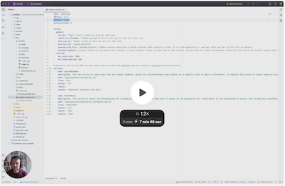

# Project Configuration (`project.yml`) for Analitiq

## Overview

The `project.yml` file serves as the main configuration file for an Analitiq project. It must be located in the project's root directory. This file specifies various parameters that define the behavior and settings of your Analitiq application.
The file `project.yml` has all of your project data, such as where the logs are stored. 
Most importantly, `project.yml` defines where your custom Services are located so Analitiq can pick them up and use them to manage your data.

[](https://www.loom.com/share/a0b6f3b2bcd148408786e0e44b430558?sid=1d8d51f1-28c3-4944-a00c-d42d6b15a64e)


```yaml
name: 'analitiq'
version: '0.1'
profile: 'test'
config_version: 2

config:
  general:
    chat_log_dir: "chats" # this is where we save our chat logs.
    sql_dir: "analysis" # this is where the ETL SQLs are being saved and managed
    services_dir: "custom_agents"
    session_uuid_file: 'session_uuid.txt' # Where session identifier is being recorded. When session is reset, it is like beginning of a new chat topic and new log file will be created.
    target_path: "target"
    message_lookback: 5 # when LLM has no clue about users request, or users request relates to some item in chat history, how far back (in number of messages) should the LLM look in the current session chat log
  vectordb:
    doc_chunk_size: 2000
    doc_chunk_overlap: 200

services:
  - name: ChartService
    description: "Use this service to generate script for APEX charts to visualize data"
    path: "custom_agents/chart/chart.py"
    class: "Chart"
    method: "run"
    inputs: "dataframe as serialized json"
    outputs: "javascript that is used by the frontend to visualize data"
```

### Key Sections and Parameters

- `name`: The name of your project.
- `version`: The version of your project.
- `profile`: Defines which profile from the [profiles.yml](/getting_started/profiles) is being used by this project.
- `config_version`: (Not used currently) Placeholder for future use.

#### General Configuration

- `chat_log_dir`: Directory for saving chat logs.
- `sql_dir`: Storage for ETL SQL scripts.
- `services_dir`: Directory for custom services.
- `session_uuid_file`: Tracks session identifiers.
- `message_lookback`: Defines how far back the AI should refer in the conversation history when needed.

#### Vector Database Configuration

- `doc_chunk_size`: Size of document chunks in characters.
- `doc_chunk_overlap`: Overlap in characters between document chunks for consistency.

### Services Configuration

Services define tasks like data visualization, PDF parsing, or API interactions. Each service is detailed with its functionality, input, and output specifications.

#### Example: ChartService

- `path`: Location of the service script.
- `class & method`: Specifies the class and method to execute the service.
- `inputs & outputs`: Defines the expected inputs and the format of outputs.

## Usage

This configuration file enables the Analitiq framework to understand and manage project-specific settings and services efficiently. It is vital for running custom services and managing data interactions within the framework.

