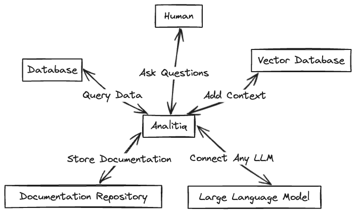
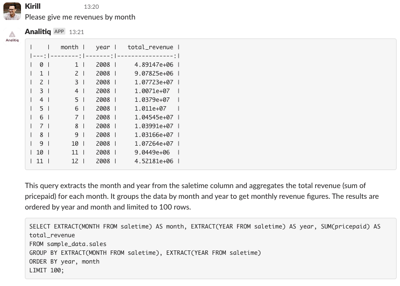
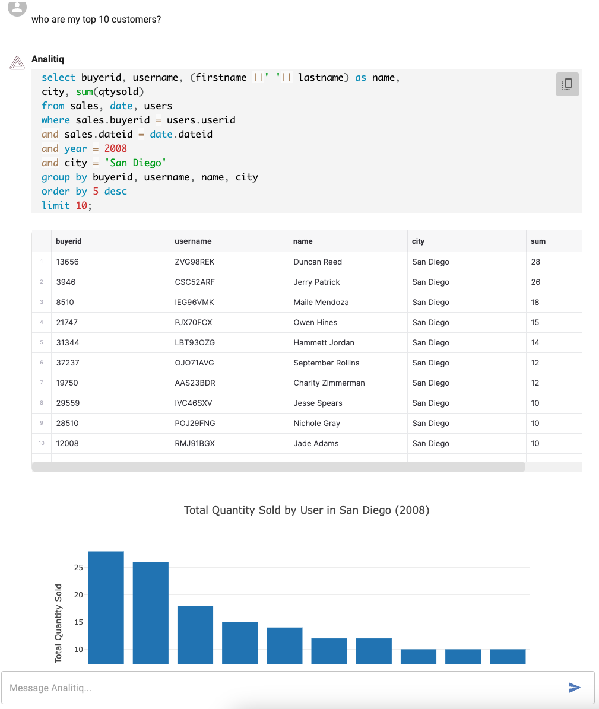

# About Analitiq
Analitiq is a framework for managing data using LLMs. Analitiq can be extended with your own custom services written in Python. 
These custom services can address your unique tasks for managing your data, and they can function as part of the overall analytical engine of Analitiq.

## Supported Databases
Analitiq currently supports the following LLM models
- Postgres
- Redshift

## Supported LLMs
Analitiq currently supports the following LLM models
- ChatGPT
- Mistral
- Bedrock (AWS)

## Supported Vector Databases
Analitiq currently integrates with the following vectorDBs
- Weaviate
- ChromaDB

## Usage Examples

## Keywords

- `FAIL` - this keyword will instruct Analitiq that response was not what was expected. This will cause Analitiq to record the chat in a `failed.log` file. 

## What Analitiq needs to work
Since Analitiq is a framework to help data people manage data using LLMs, it requires at the least:

1. Access to LLM(s) - **required**
2. Access to Database - **required**
3. Access to Vector Database with documentation - optional

## User Interface
Analitiq currently supports Slack chat.

There is also a dedicated Web interface (closed beta) at [www.analitiq-app.com](https://www.analitiq-app.com/login/)

The app interface can be extended with a UI, such as streamlit app.
