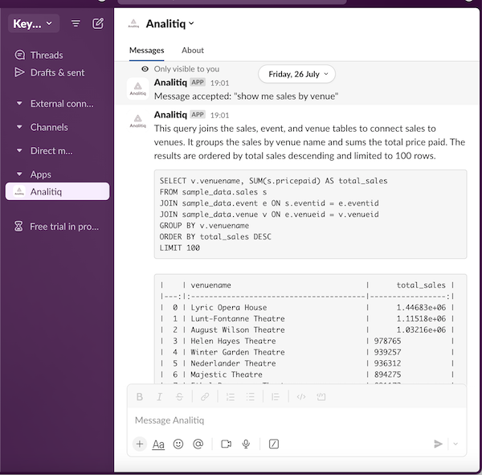

# About Analitiq
Analitiq is a comprehensive framework designed to enhance data management using Large Language Models (LLMs). Our goal is to transcend traditional Text-to-SQL functionalities, enabling Data Engineers, Analysts, and non-technical users to interact with data effortlessly through natural language and advanced AI capabilities.

With Analitiq, you can harness the power of LLMs to:

- Query data from your Data Warehouse.
- Search for information across your company wiki, SQL files, and Data Warehouse schema.
- Create custom agents tailored to your data management needs.
- Utilize your preferred LLM, whether it's a private model via Ollama or public APIs like OpenAI and Mistral.

## Deployment Options
 - **Self-hosted**: Self-hosted Analitiq option will let you run it in your own environment.
 - **Cloud**: Analitiq cloud is a managed service for Enterprise customers.

## User Interfaces for Analitiq Cloud
### Slack
Analitiq Cloud can be added to a Slack account to allow anyone in the organisation to interact with data using LLMs.

### Web UI
Analitiq Cloud can be accessed via our UI interface.

## Supported Databases
Analitiq currently supports the following LLM models
- Postgres
- Redshift

## Supported LLMs
Analitiq currently supports the following LLM models
- ChatGPT
- Mistral
- Bedrock (AWS)

## Supported Vector Databases
Analitiq currently integrates with the following vectorDBs
- Weaviate
- ChromaDB

## Usage Examples

## Keywords

- `FAIL` - this keyword will instruct Analitiq that response was not what was expected. This will cause Analitiq to record the chat in a `failed.log` file. 

## What Analitiq needs to work
Since Analitiq is a framework to help data people manage data using LLMs, it requires at the least:

1. Access to LLM(s) - **required**
2. Access to Database - **required**
3. Access to Vector Database with documentation - optional
